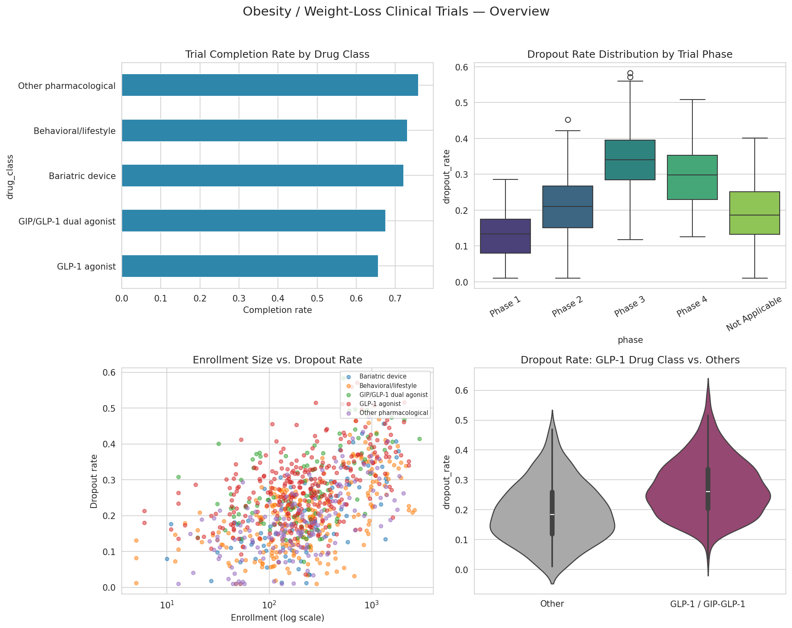
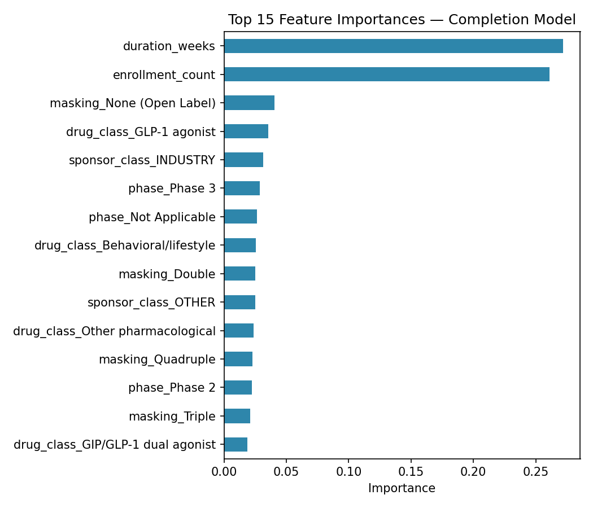
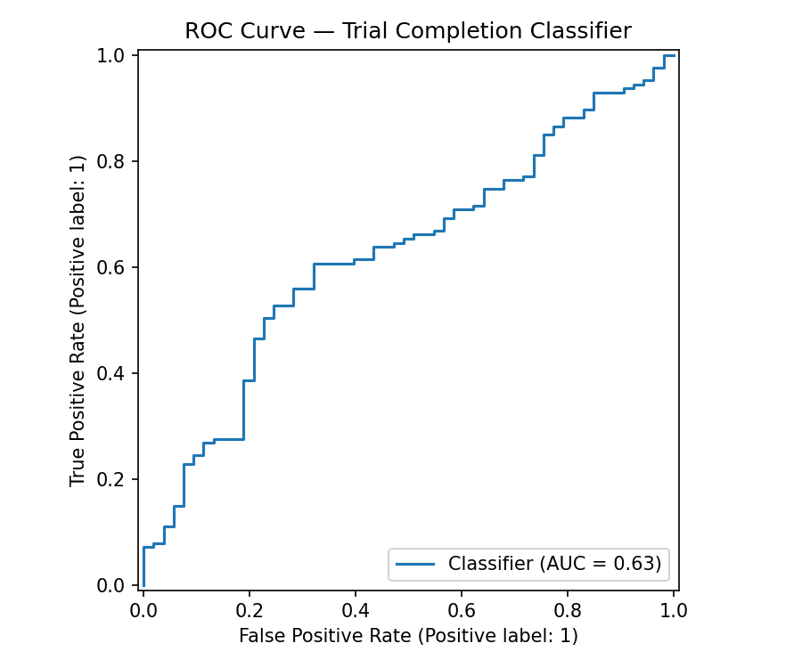
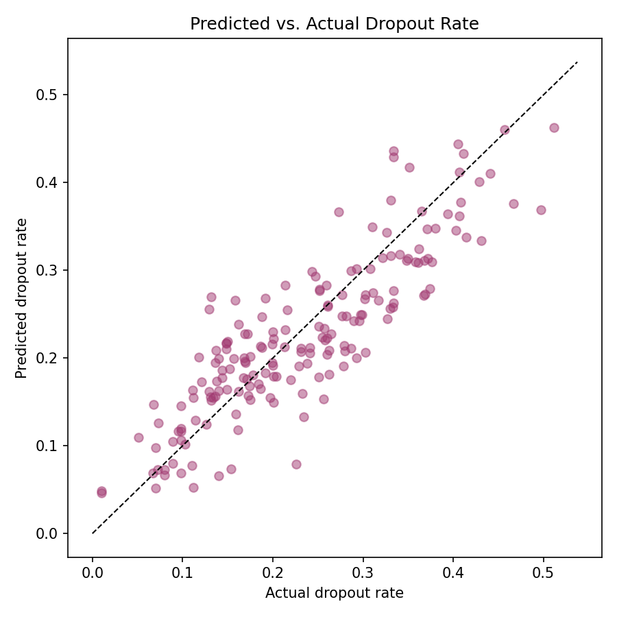

# 🧬 Weight-Loss Clinical Trial Predictor

A machine learning pipeline and exploratory data analysis (EDA) framework designed to model patient outcomes, analyze trial variables, and predict dropout behaviors within weight-loss clinical trials.

---

## 🚀 Project Overview

Clinical trials face significant hurdles with patient retention and outcome variability. This repository contains data-driven modeling approaches to extract insights from trial features, evaluate classification performance, and identify key drivers behind patient success and dropout risk.

---

## 📊 Visual Insights & Model Evaluation

| Exploratory Data Analysis | Feature Importance |
| :---: | :---: |
|  |  |
| *High-level feature distributions and correlations within the dataset.* | *Key predictive drivers identified by the classification model.* |

| ROC-AUC Performance | Dropout Predictions vs. Actuals |
| :---: | :---: |
|  |  |
| *Evaluation curve assessing classification trade-offs.* | *Mapping predicted patient dropout probabilities against actual outcomes.* |

---

## 📁 Repository Structure

* **`weight-loss-trial-predictor (1).zip`**: Complete source code package, preprocessing scripts, and underlying dataset.
* **`eda_overview.png`**: Visual summary of data distributions and feature correlations.
* **`feature_importance_classifier.png`**: Ranking of the most influential variables driving the model.
* **`roc_curve.png`**: Model performance evaluation via ROC-AUC analysis.
* **`dropout_pred_vs_actual.png`**: Comparative plot tracking predicted vs. actual dropout rates.

---

## 🛠️ Built With

* **Python** (Pandas, Scikit-Learn, Matplotlib, Seaborn)
* **Machine Learning Pipelines** for predictive classification and risk analysis
